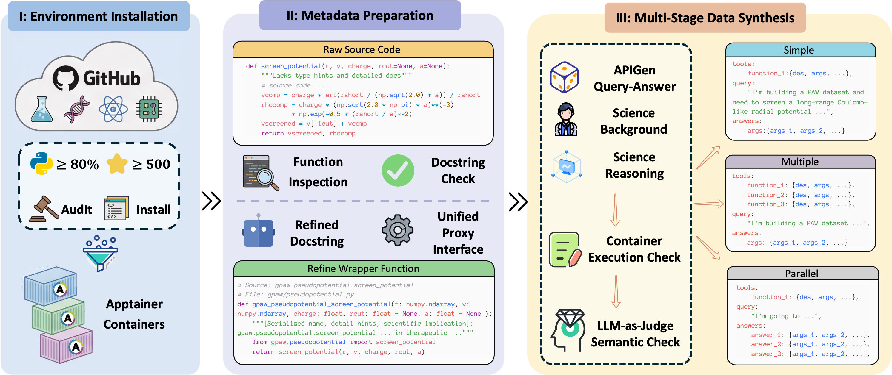
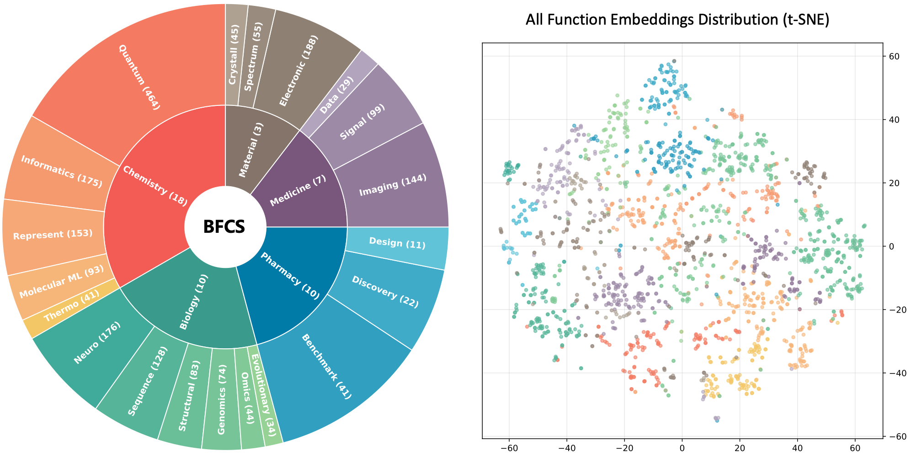

#  BFCS: A Large-Scale Execution-Based Benchmark for Function Calling in Science

This repository contains the official implementation of the paper: **"BFCS: A Large-Scale Execution-Based Benchmark for Function Calling in Science"**.



## 🌟 Overview

**BFCS** is the first execution-based benchmark specifically designed to evaluate the function-calling capabilities of Large Language Models (LLMs) in scientific domains.
Unlike static benchmarks, BFCS adopts an **execution-first philosophy**:

- **Real-World Scale:** Includes **1,648 function-query-answer pairs** across chemistry, biology, pharmacy, medicine, and materials science.
- **Standardized Environment:** Integrated with **48 real scientific Python libraries** (e.g., RDKit, Biopython) and **2,100 executable tools**.
- **Rigorous Evaluation:** Uses **Apptainer** for container-native isolation to ensure reproducibility and verify functional correctness (ESR) and semantic accuracy (AMR).

## 📊 Main Results

| Model | Simple ESR | Simple AMR | Simple Gap↓ | Multiple ESR | Multiple AMR | Multiple Gap↓ | Parallel ESR | Parallel AMR | Parallel Gap↓ | **Overall ESR** | **Overall AMR** | **Overall Gap↓** |
| --- | --- | --- | --- | --- | --- | --- | --- | --- | --- | --- | --- | --- |
| ***Proprietary Models*** | | | | | | | | | | | | |
| **Claude-Opus-4.5** | **98.94** | **69.74** | 29.21 | **99.39** | **65.97** | 33.42 | 93.85 | **75.89** | **17.96** | **97.39** | **70.53** | 26.86 |
| **Claude-Sonnet-4.5** | 97.71 | 60.11 | 37.60 | 95.09 | 63.82 | 31.27 | **95.47** | 68.47 | 27.00 | 96.09 | 64.13 | 31.96 |
| **Gemini-3-Pro** | 97.15 | 69.69 | **27.47** | 93.81 | 63.03 | 30.78 | 92.28 | 73.30 | 18.99 | 94.42 | 68.67 | **25.74** |
| **Gemini-3-Flash** | 94.47 | 64.50 | 29.96 | 92.18 | 61.09 | 31.09 | 85.71 | 65.68 | 20.03 | 90.79 | 63.76 | 27.03 |
| **GPT-5.2** | 92.80 | 65.23 | 27.56 | 93.13 | 64.44 | **28.69** | 92.41 | 61.12 | 31.28 | 92.78 | 63.60 | 29.18 |
| **Doubao-Seed-1.8** | 95.61 | 50.19 | 45.42 | 98.18 | 36.00 | 62.18 | 93.21 | 43.73 | 49.48 | 95.67 | 43.31 | 52.36 |
| ***Open-Weight Models*** | | | | | | | | | | | | |
| **DeepSeek-V3.2** | 89.12 | 54.77 | **34.35** | 91.27 | 54.91 | 36.36 | **98.26** | 4.53 | 93.73 | 92.88 | 38.07 | 54.81 |
| **GLM-4.7** | 91.27 | 48.28 | 42.99 | 96.26 | **61.07** | **35.19** | 91.02 | **58.23** | **32.79** | 92.85 | 55.86 | **36.99** |
| **Kimi-k2.5** | 91.98 | 44.85 | 47.14 | 89.64 | 29.09 | 60.55 | 84.84 | 40.42 | 44.43 | 88.82 | 38.12 | 50.70 |
| **Mistral-Large-3** | **100.00** | 48.28 | 51.72 | **100.00** | 49.64 | 50.36 | 91.29 | 43.90 | 47.39 | 97.10 | 47.27 | 49.82 |
| **Qwen3-235B** | 97.62 | **59.21** | 38.42 | 99.69 | 60.58 | 39.12 | 94.58 | 57.69 | 36.89 | **97.30** | **59.16** | 38.14 |
| **Qwen3-30B** | 93.13 | 42.07 | 51.06 | 97.49 | 38.63 | 58.86 | 90.54 | 34.24 | 56.30 | 93.72 | 38.31 | 55.41 |

*Note: ESR (Execution Success Rate) measures if the code runs; AMR (Answer Match Rate) measures if the scientific logic is correct. Gap = ESR − AMR, where a positive gap indicates potential silent failures. All values are in percentages.*

## 🚀 Getting Started

### 1. Prerequisites

We use **Apptainer** (formerly Singularity) to manage complex scientific dependencies.

```bash
# Install Apptainer (refer to official docs for details)
sudo apt-get update && sudo apt-get install -y apptainer
```

### 2. Download Data & Containers

The benchmark is stratified into three scenarios:

- **Simple:** Atomic instruction synthesis.
- **Multiple:** Tool selection among distractors.
- **Parallel:** Compositional batch processing.

```bash
git clone https://github.com/ChampionZhong/BFCS.git
cd BFCS
# Build scientific environment containers
bash containers/build_apptainers_*.sh
```

### 3. Run Evaluation

```bash
python evalution/run_eval.py --model_name your_model_name --scenario simple
```

## 📂 Dataset Taxonomy



*Overview of repositories and corresponding packages which can be `import` in Python environment, covering the category assigned to each repository and the total count of available wrapper functions.*

| # | Repo Name (Original Repo) | Package Name (Package Card) | Category | Tools | LICENSE |
| :--: | :----------------------------------------------------------: | :----------------------------------------------------------: | :-------: | :---: | :----------: |
| 1 | [AiZynthFinder](https://github.com/MolecularAI/aizynthfinder) | [aizynthfinder](packages/pharmacy/aizynthfinder.md) | Pharmacy | 3 | MIT |
| 2 | [anndata](https://github.com/scverse/anndata) | [anndata](packages/biology/anndata.md) | Biology | 8 | BSD-3-Clause |
| 3 | [batchgenerators](https://github.com/MIC-DKFZ/batchgenerators) | [batchgenerators](packages/medicine/batchgenerators.md) | Medicine | 26 | Apache-2.0 |
| 4 | [bioemu](https://github.com/microsoft/bioemu) | [bioemu](packages/biology/bioemu.md) | Biology | 153 | MIT |
| 5 | [biopython](https://github.com/biopython/biopython) | [Bio](packages/biology/Bio.md) | Biology | 4 | BSD-3-Clause |
| 6 | [boltz](https://github.com/jwohlwend/boltz) | [boltz](packages/pharmacy/boltz.md) | Pharmacy | 46 | MIT |
| 7 | [CEBRA](https://github.com/AdaptiveMotorControlLab/CEBRA) | [cebra](packages/biology/cebra.md) | Biology | 14 | Apache-2.0 |
| 8 | [chai-lab](https://github.com/chaidiscovery/chai-lab) | [chai_lab](packages/biology/chai_lab.md) | Biology | 12 | Apache-2.0 |
| 9 | [chembl-downloader](https://github.com/cthoyt/chembl-downloader) | [chembl_downloader](packages/pharmacy/chembl_downloader.md) | Pharmacy | 2 | MIT |
| 10 | [ChemInformant](https://github.com/HzaCode/ChemInformant) | [ChemInformant](packages/chemistry/ChemInformant.md) | Chemistry | 5 | MIT |
| 11 | [chemprop](https://github.com/chemprop/chemprop) | [chemprop](packages/pharmacy/chemprop.md) | Pharmacy | 4 | MIT |
| 12 | [chempy](https://github.com/bjodah/chempy) | [chempy](packages/chemistry/chempy.md) | Chemistry | 45 | BSD-2-Clause |
| 13 | [CIRpy](https://github.com/mcs07/CIRpy) | [cirpy](packages/chemistry/cirpy.md) | Chemistry | 6 | MIT |
| 14 | [datamol](https://github.com/datamol-io/datamol) | [datamol](packages/chemistry/datamol.md) | Chemistry | 13 | Apache-2.0 |
| 15 | [deepchem](https://github.com/deepchem/deepchem) | [deepchem](packages/pharmacy/deepchem.md) | Pharmacy | 128 | MIT |
| 16 | [DeepPurpose](https://github.com/kexinhuang12345/DeepPurpose) | [DeepPurpose](packages/pharmacy/DeepPurpose.md) | Pharmacy | 31 | BSD-3-Clause |
| 17 | [descriptastorus](https://github.com/bp-kelley/descriptastorus) | [descriptastorus](packages/chemistry/descriptastorus.md) | Chemistry | 3 | BSD-3-Clause |
| 18 | [drugbank_downloader](https://github.com/cthoyt/drugbank_downloader) | [drugbank_downloader](packages/pharmacy/drugbank_downloader.md) | Pharmacy | 1 | MIT |
| 19 | [dscribe](https://github.com/SINGROUP/dscribe) | [dscribe](packages/material/dscribe.md) | Material | 7 | Apache-2.0 |
| 20 | [gpaw](https://gitlab.com/gpaw/gpaw) | [gpaw](packages/material/gpaw.md) | Material | 263 | GPLv3+ |
| 21 | [guacamol](https://github.com/BenevolentAI/guacamol) | [guacamol](packages/pharmacy/guacamol.md) | Pharmacy | 5 | MIT |
| 22 | [lungmask](https://github.com/JoHof/lungmask) | [lungmask](packages/medicine/lungmask.md) | Medicine | 8 | Apache-2.0 |
| 23 | [mace](https://github.com/ACEsuit/mace) | [mace](packages/material/mace.md) | Material | 7 | MIT |
| 24 | [MedCLIP](https://github.com/RyanWangZf/MedCLIP) | [medclip](packages/medicine/medclip.md) | Medicine | 3 | Unknown |
| 25 | [mendeleev](https://github.com/lmmentel/mendeleev) | [mendeleev](packages/chemistry/mendeleev.md) | Chemistry | 23 | MIT |
| 26 | [molmass](https://github.com/cgohlke/molmass) | [molmass](packages/chemistry/molmass.md) | Chemistry | 14 | BSD-3-Clause |
| 27 | [MONAI](https://github.com/Project-MONAI/MONAI) | [monai](packages/medicine/monai.md) | Medicine | 96 | Apache-2.0 |
| 28 | [mordred](https://github.com/mordred-descriptor/mordred) | [mordred](packages/chemistry/mordred.md) | Chemistry | 1 | BSD-3-Clause |
| 29 | [ncbi-genome-download](https://github.com/kblin/ncbi-genome-download) | [ncbi_genome_download](packages/biology/ncbi_genome_download.md) | Biology | 21 | Apache-2.0 |
| 30 | [NistChemPy](https://github.com/IvanChernyshov/NistChemPy) | [nistchempy](packages/chemistry/nistchempy.md) | Chemistry | 1 | MIT |
| 31 | [nnUNet](https://github.com/MIC-DKFZ/nnUNet) | [nnunetv2](packages/medicine/nnunetv2.md) | Medicine | 20 | Apache-2.0 |
| 32 | [periodictable](https://github.com/pkienzle/periodictable) | [periodictable](packages/chemistry/periodictable.md) | Chemistry | 21 | BSD-3-Clause |
| 33 | [PubChemPy](https://github.com/mcs07/PubChemPy) | [pubchempy](packages/chemistry/pubchempy.md) | Chemistry | 2 | MIT |
| 34 | [pybel](https://github.com/pybel/pybel) | [pybel](packages/biology/pybel.md) | Biology | 46 | MIT |
| 35 | [pyEQL](https://github.com/KingsburyLab/pyEQL) | [pyEQL](packages/chemistry/pyEQL.md) | Chemistry | 4 | LGPLv3 |
| 36 | [pyRiemann](https://github.com/pyRiemann/pyRiemann) | [pyriemann](packages/medicine/pyriemann.md) | Medicine | 100 | BSD-3-Clause |
| 37 | [pyscf](https://github.com/pyscf/pyscf) | [pyscf](packages/chemistry/pyscf.md) | Chemistry | 449 | Apache-2.0 |
| 38 | [rdkit](https://github.com/rdkit/rdkit) | [rdkit](packages/chemistry/rdkit.md) | Chemistry | 110 | BSD-3-Clause |
| 39 | [robert](https://github.com/jvalegre/robert) | [robert](packages/chemistry/robert.md) | Chemistry | 38 | MIT |
| 40 | [scanpy](https://github.com/scverse/scanpy) | [scanpy](packages/biology/scanpy.md) | Biology | 21 | BSD-3-Clause |
| 41 | [selfies](https://github.com/aspuru-guzik-group/selfies) | [selfies](packages/chemistry/selfies.md) | Chemistry | 13 | Apache-2.0 |
| 42 | [spikeinterface](https://github.com/SpikeInterface/spikeinterface) | [spikeinterface](packages/biology/spikeinterface.md) | Biology | 159 | MIT |
| 43 | [stk](https://github.com/lukasturcani/stk) | [stk](packages/chemistry/stk.md) | Chemistry | 12 | MIT |
| 44 | [tape](https://github.com/songlab-cal/tape) | [tape](packages/biology/tape.md) | Biology | 7 | BSD-3-Clause |
| 45 | [TDC](https://github.com/mims-harvard/TDC) | [tdc](packages/pharmacy/tdc.md) | Pharmacy | 118 | MIT |
| 46 | [torchdrug](https://github.com/DeepGraphLearning/torchdrug) | [torchdrug](packages/pharmacy/torchdrug.md) | Pharmacy | 16 | Apache-2.0 |
| 47 | [torchio](https://github.com/TorchIO-project/torchio) | [torchio](packages/medicine/torchio.md) | Medicine | 3 | Apache-2.0 |
| 48 | [useful_rdkit_utils](https://github.com/PatWalters/useful_rdkit_utils) | [useful_rdkit_utils](packages/chemistry/useful_rdkit_utils.md) | Chemistry | 8 | MIT |

## 📃 License & Acknowledgements

The source code of the wrappers and the build scripts in this repository are licensed under the Apache License 2.0.

However, the software packages installed within the containers retain their original licenses. Users are responsible for complying with the licenses of the underlying packages when using them:

**ATTENTION** GPLv3+: `gpaw` (Please note that using `gpaw` may impose copyleft obligations)

## ✍️ Citation

If you find this work helpful, please cite our work:
<!-- booktitle={Proceedings of the 32nd ACM SIGKDD Conference on Knowledge Discovery and Data Mining}, -->
```code snippet
@misc{zhong2026bfcs,
  title={BFCS: A Large-Scale Execution-Based Benchmark for Function Calling in Science},
  author={Zhong, Zhanping and Su, Xuerui and Zhang, Wei and Pei, Qizhi and Wang, Zun and He, Conghui and Wu, Lijun},
  publisher = {GitHub},
  journal = {GitHub repository},
  howpublished = {\url{[https://github.com/ChampionZhong/BFCS](https://github.com/ChampionZhong/BFCS)}},
  year={2026},
}

```
